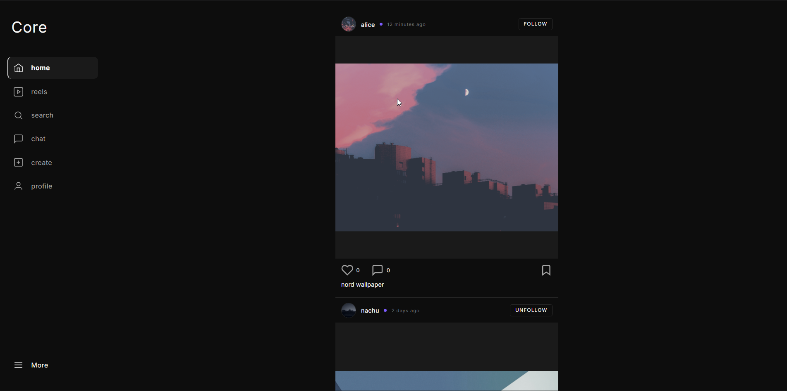

# Social Media Core

A full-stack social media app built with the MERN stack.

## Features

**Auth**
- Register / login / logout

**Profile**
- Edit profile
- Search users by username

**Posts**
- Create, edit caption, delete
- Like / unlike
- Comment, delete comment

**Reels**
- Swipe/scroll through reels
- Comment on reels

**Follow system**
- Follow / unfollow users
- View followers and following list

**Chat**
- Search users to start a conversation
- Real-time messaging with Socket.io
- Online/offline status

## Stack

MongoDB, Express, React, Node.js, Socket.io, Cloudinary
